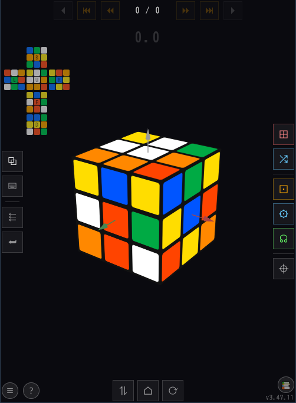

# 🎲 Cube Puzzle Simulator

A 3x3 cube puzzle simulator that runs in your browser.  
Deployed on [GitHub Pages](https://itachiwalker.github.io/cubew).

**Current version: v3.47.11**

<!-- TODO: replace screenshot.png below with an actual screenshot (place it at the root of the cubew repo) -->


---

## 🚀 Getting Started

Just open GitHub Pages [https://itachiwalker.github.io/cubew](https://itachiwalker.github.io/cubew) to play.  
Verified to work on: Windows (Firefox / Chrome) · Android (Chrome) · iPhone (Safari)

---

## ✨ Features

| Feature | Description |
|------|------|
| Swipe rotation | Intuitively rotate a layer by swiping a face. Fast, consecutive swipes are buffered so none are dropped |
| Wide () / Double () toggle | A one-shot toggle that applies a wide move (e.g. Rw) or a double move (e.g. U2) to just the next swipe (including keyboard input) |
| Double-tap commands | Double-tap any cell on a face to automatically run its registered command. Undo (double-tap the background) reverts an entire command's moves in a single step |
| Command editor () | Long-press to enter recording mode and register a cube operation as a command, with automatic copying across other faces, left-right mirroring, and to the U face |
| Scramble | 100 random moves (excluding the face used in the previous move, chosen from the remaining 5), with a speed effect |
| History navigation | Step through the full move history — including autoplay and reverse-play — with . The next move is shown as an arrow on the cube while navigating |
| Pinned camera () | Shown only while browsing freely, browsing a command, or browsing an exam. When on,  recreate the camera angle at the moment each move was actually made. During autoplay, background dragging and the three camera buttons () are automatically disabled |
| Rotation button pad () | Six full rows of buttons: U/D/E, R/L/M, F/B/S, x/y/z, plus wide moves (Uw/Dw/Rw/Lw/Fw/Bw) |
| Step-by-step (SbS) mode | Run a move sequence entered in the SET dialog in "Step by Step" mode, advancing one move at a time by swiping, guided by arrows |
| Aiming overlay (C_XX) | During an SbS sequence, shows a reticle (a circle with crosshairs) on a specified cell; double-tap or  automatically runs the associated command |
| Guide arrows | Color fade-in arrows show the next move on the cube during navigation/step mode. 180° moves are marked "×2" |
| Camera control (CAM) | Set the camera viewpoint during an SbS sequence with `CAM(θ,φ)`. The most recently declared CAM is shared between forward and reverse playback, and manual view adjustments are preserved within the same CAM group |
| Face correction () | Automatically reorients the cube to green-front / white-up from any angle |
| Cube state editor () | Tabbed (Settings / History). The Settings tab lets you read/write the cube's state as a 54-character kociemba-format string and run commands (with wildcard support: `W`/`w`/lowercase face letters). The History tab shows the initial state string and the move-command string, each with a copy button |
| External solver () | Validates the state, then — after a confirmation dialog — solves all six faces automatically. The solution runs automatically after a countdown |
| Exam mode | Freely manipulate the cube from a given initial state toward a given goal state; a "congratulations" effect plays once the goal is matched (the  rotation button pad remains usable during exam mode) |
| Stopwatch | Starts automatically on the first manual move after a scramble, stops automatically once solved. Your ranking is shown on stop (including "off the leaderboard"). Tap the time while it's flashing white to view high scores |
| High scores | Saves your top 10 solve times after each scramble. The high score screen is shown automatically after clearing, with this run's time highlighted |
| Celebration effects | Confetti, a camera spin, and a message (in 9 languages; long text scrolls horizontally) when the cube is solved |
| Net (unfolded) view () | Always visible, updates in real time as you move; cycles through 3 layout patterns |
| Tutorial | Step-by-step lessons for the LBL method, guided by arrows, aiming reticles, and camera moves at every step. Available in 9 languages. Launched from the 📚 button next to . " Back" resets the current lesson/exam if there's progress, or moves to the previous item if not |
| Bulk command registration | Each level heading in the tutorial list has a " Register all" button, which registers every lesson's commands within that level at once, and detects conflicts (a warning, aimed at the author, when the same cell has different content across lessons) |
| Tutorial notation | `C_F3(seq)` = aiming command / `R(F)` = arrow limited to one face / `CAM(θ,φ)` = camera move (2 arguments) / `X2'` = directional 180° |
| Share | Share the app's URL via the Web Share API ( menu). Automatically hidden when run from a local file (`file:` / `content:` / `blob:`) |
| QR code | Display the current URL as a QR code (only when launched over the web,  menu) |
|  menu | Settings, share, QR code, help, high scores, license |
| Settings screen | Language (9 languages), speed (4 levels), and axis-display settings |
| License display | Shows the full license text of the OSS used ( → License) |
| Tooltip (?) | 4-stage toggle: quick help page → left panel → right panel → cleared. Shown automatically on page load |
| Multi-language support | Japanese, Chinese, French, English, Korean, Spanish, Portuguese, German, Russian (9 languages) |
| localStorage persistence | Speed, language, axis display, command bindings, pin setting, and high scores all persist across browser restarts |

---

## 🎮 Controls

### Touch / Mouse

| Action | Effect |
|------|------|
| Swipe a cube face | Rotates that layer 90° |
| Double-tap a cube face | Runs its registered command |
| Long-press a cube face | Records/registers a command |
| Double-tap the background | Undo (in free mode) / step back one move (while navigating). Note: the  button itself has been hidden, but the function is still available |
| Drag the background | Rotate the camera view (works even during animation. Disabled during autoplay if the pin is on) |
| Two-finger pinch | Zoom in/out |
| Tap the timer (while flashing white) | Shows the high score screen |

### Keyboard shortcuts

| Key | Action |
|------|------|
| u/U d/D f/F b/B l/L r/R | Rotate each face clockwise/counter-clockwise |
| m/M e/E s/S | Rotate the M/E/S layer clockwise/counter-clockwise |
| x/X y/Y z/Z | Rotate the whole cube around the X/Y/Z axis |
| ← / → | Step back/forward while browsing history or in SbS mode |
| h | Return the camera to its home position |
| w | Toggle the wide () modifier on/off |
| 2 | Toggle the double () modifier on/off |

---

## 🔘 Buttons

### Top (navigation)

| Button | Function |
|--------|------|
|   | Reverse-play / play (auto-step through history) |
|     | Jump to first/previous/next/last in history |

### Right panel

| Button | Function |
|--------|------|
|  | Reset (always disabled during a tutorial; merged into " Back") |
|  | Scramble |
|  | Face correction |
|  | Cube state editor (Settings/History tabs) |
|  | External solver (validate → confirm → auto-run) |
|  | Command editor dialog |

### Left panel

| Button | Function |
|--------|------|
|  | Show/hide net view (cycles through 3 layouts) |
|  | Show/hide the rotation button pad |
|  | Make the next single swipe a wide move |
|  | Make the next single swipe a double move |

### Bottom panel

| Button | Function |
|--------|------|
|  | Show tooltip help (4-stage toggle). Shown automatically on load. Disabled during a tutorial |
|  | Sweep the camera vertically |
|  | Return the camera to its default position |
|  | Sweep the camera horizontally, full circle |
|  | Pin the camera (shown only while browsing freely/commands/exams). When on,  recreate the camera angle at the moment each move was actually made |
| 📚 / 🚪 | Open the tutorial list / exit it (shown in the same slot, mutually exclusive). Enabled/disabled/hidden depending on the current mode (hidden while recording, disabled while browsing freely, in SbS guide mode, or browsing an exam) |

### Screen edges (stacked vertically)

| Button | Function |
|--------|------|
|  | Menu (settings, share, QR code, help, high scores, license) |

---

## 🛠 Tech Stack

| Item | Details |
|------|------|
| Language | HTML / CSS / vanilla JavaScript + WebAssembly (Rust) |
| 3D library | Three.js r128 (MIT) |
| Confetti library | canvas-confetti 1.9.4 (ISC) |
| Tooltips | Tippy.js 6.3.7 + Popper.js 2.11.8 (MIT, restyled with the app's own dark theme) |
| QR code | qrcode.js 1.4.4 (soldair, MIT) |
| Icons | Hand-drawn SVGs (currentColor) for the main buttons. Navigation buttons (⏸) are also being converted to SVG to avoid rendering differences across platforms |
| Font | Noto Sans Symbols 2 (Google Fonts / OFL 1.1) |
| File structure | A single HTML file |

---

## 📁 Repository Structure

Development and publishing are split across separate repositories.

```
cubew/              (public, no license = all rights reserved) ← the published app (GitHub Pages)
cubew_tutorial/     (public, MIT license) ← published tutorial data
cube_solver_api/    (public, GPL-2.0 license) ← external solver (hosted on Render)
```

### cubew (public)

`index.html`, `favicon.svg`, `about.*.html` ("About this app," in 9 languages), and the `tutorial/` files. Published via GitHub Pages.

### cubew_tutorial (public, MIT)

`default.json`, `LBL/*.png`, `terms/*.png`, `README.md`/`README.ja.md`, `schema.md`/`schema.ja.md`. The tutorial data is published on its own, and forks/modifications are welcome.

### cube_solver_api (public, GPL-2.0)

The external solver (Flask + kociemba), deployed on Render. Because kociemba is GPL-2.0 licensed, the published source must also be GPL-2.0.

---

## 📋 Versioning

Follows the `vX.Y.Z` format.

- **X**: Major (large design changes)
- **Y**: Minor (new features)
- **Z**: Patch (bug fixes and small tweaks)

---

## 🗺 Roadmap

- Loading third-party tutorial data (from an external JSON URL)
- Bookmark/export feature (save and restore an initial state + move history)

Please post feature requests on [Issues](https://github.com/itachiwalker/cubew/issues).

---

## 📄 License

The source code in this repository is not licensed; all rights are reserved by the author (No License).

### What's allowed

- Freely using (playing) this app on this service (GitHub Pages)

### Prohibited

Please refrain from the following:

- Downloading this app's files and running them anywhere other than this service
- Modifying the source code, even for personal use
- Decompiling, disassembling, deobfuscating, or otherwise analyzing the app's internal structure
- Duplicating or redistributing this app

The tutorial data ([cubew_tutorial](https://github.com/itachiwalker/cubew_tutorial)) is published separately under the MIT License and is not subject to these restrictions.
